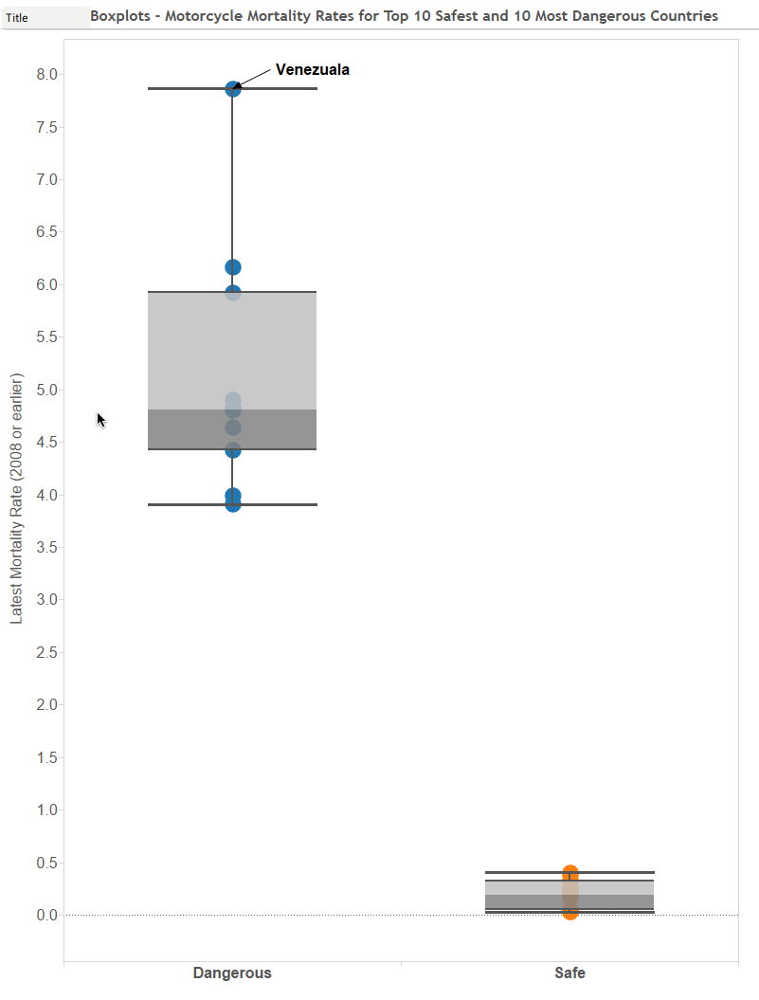

###Load the data

Let's start off with loading the dataset which was downloaded from the [Gapminder website](http://www.gapminder.org/data/). This dataset is from GIMD/WHO on 2-wheeler, motorized, mortality per 100,000 around the world from 1997-2008. 

```{r, echo=TRUE, warning=FALSE}
setwd('C:/Users/user/version-control/Leada-R-Project-4-Motorcycle-Deaths')
suppressMessages(require(xlsx))
df <- read.xlsx('mc RTI age adjusted indicator file 20100906.xlsx',  sheetName = "Data")
names(df)[1]<-"Country"
```

###Why this data?

I chose this dataset as it's almost spring here in Beautiful British Columbia. I'm ready to renew my motorcycle insurance for my Royal Enfield Bullet for another season. I decided to see if the anecdotes I hear about how dangerous motorcycling is are supported by the data and I was also interested to see how Canada compares with other countries around the world.


###Clean the data

```{r, echo=TRUE, warning=FALSE}
# Let's ensure all countries are accounted for - assumption we are using the latest year for which there is data if not 2008
library(data.table)
library(reshape2)
mc <- na.omit(melt(as.data.table(df, keep.rownames = TRUE), 
             id.vars = "rn"))[, value[.N], by = rn]
#merge with countries column
mc <- cbind(mc,df$Country)
mc <- subset(mc, select=c(3,2))
colnames(mc) <- c("Country","Latest_Mortality_Rate")
#Delete a few countries with no data #edit(mc) - easier to copy and paste country names
nodata <- c("Azerbaijan", "Bahrain", "Fiji", "Grenada", "Guyana", "Mauritius", "Qatar")
for (country in nodata){
  mc <- mc[grep(country, mc$Latest_Mortality_Rate, invert = TRUE) , ]
}
```

###Safest Country

```{r, echo=TRUE, warning=FALSE}
minimum <- min(mc$Latest_Mortality_Rate)
safest_country <- as.character(mc[mc$Latest_Mortality_Rate==minimum, Country])
```
***`r safest_country`*** is the safest country in terms of motorycyle deaths at `r minimum` deaths/100,000 in a year.

###Largest Improvement in Safety

```{r, echo=TRUE, warning=FALSE}
#We will only consider columns that are NOT NA in both year (1998 & 2008)
#split up into two dfs
df1998 <- df[,1:15]
df2008 <- df[,c(1,16:25)]
#if NA in 1998 we will choose the latest year of data, same with 2008 dataframe
library(data.table)
library(reshape2)
df1998 <- na.omit(melt(as.data.table(df1998, keep.rownames = TRUE), 
             id.vars = "rn"))[, value[.N], by = rn]
df2008 <- na.omit(melt(as.data.table(df2008, keep.rownames = TRUE), 
             id.vars = "rn"))[, value[.N], by = rn]
#let's merge into one dataframe
dfchange <- cbind(df1998,df2008,df$Country)
#Keep only applicable columns and rename them
colnames(dfchange) <- c("rn","X1998","rn","X2008","Country")
dfchange <- subset(dfchange, select= c(5,2,4))
#Some countries still have no data in either 2008 or 1998
#Convert text to NAs
dfchange$X1998<- as.numeric(dfchange$X1998)
dfchange$X2008<- as.numeric(dfchange$X2008)
dfchange <- dfchange[complete.cases(dfchange),]
#Now we have all countries with data in each year so we can compare
dfchange <- transform(dfchange, improvement = X1998-X2008)
maximum <- max(dfchange$improvement)
largest_improvement <- as.character(dfchange[dfchange$improvement==maximum,Country])
improvement1998 <- dfchange[dfchange$improvement==maximum,X1998]
improvement2008 <- dfchange[dfchange$improvement==maximum,X2008]
```
The country with the largest improvement in the ten year period from 1998 to 2008 is 
**`r largest_improvement`** which improved from `r improvement1998` to `r improvement2008`

###Where does Canada rank in terms of motorcyclist safety? What is the most dangerous country?

```{r echo=FALSE, warning=FALSE}
#sort from lowest to highest for the latest year of data available for each country
mc <- mc[order(mc$Latest_Mortality_Rate),]
canada_rank <- which(mc$Country == "Canada")
canada_rate <- mc[canada_rank,Latest_Mortality_Rate]
highest_rate <- max(mc$Latest_Mortality_Rate)
dangerous_country <- as.character(mc[mc$Latest_Mortality_Rate==highest_rate,Country])
```

Canada is considered the `r canada_rank`th safest country out of these `r nrow(mc)` countries that we have data for.The mortality rate per 100,000 people is `r canada_rate`/100,000 compared with the highest mortality rate for 2-wheelers which is `r highest_rate` per 100,000 people. This unfortunate honour goes to the South American country of **`r dangerous_country`**. 

###On average, how much safer are the 10 safest countries vs the most dangerous?
```{r echo=TRUE, warning=FALSE}
safest_mc <- mc[1:10,]
dangerous_mc <- mc[(nrow(mc)-10):nrow(mc),]
```
###Prepare data for visualization

```{r echo=TRUE, warning=FALSE}
safest_mc <- mc[1:10,]
dangerous_mc <- mc[(nrow(mc)-9):nrow(mc),]
safest_mc$safety_level <- factor("Safe")
dangerous_mc$safety_level <- factor("Dangerous")
#Combine top10 safest and most dangerous
top10 <- rbind(safest_mc,dangerous_mc)
#Export to csv, for use in Tableau
#write.csv(top10, "top10_motorcycle_safety.csv") 
#Sort by Mortality Rates, and safety level
top10 <- top10[order(top10$Latest_Mortality_Rate,top10$safety_level)]
#The top 10 most dangerous are not sorted from highest to lowest as I'd like
dangerous_mc$Latest_Mortality_Rate <- as.numeric(dangerous_mc$Latest_Mortality_Rate)
dangerous_mc <- dangerous_mc[order(-dangerous_mc$Latest_Mortality_Rate)]
#now I'll just append it to a subset of the first dataframe
top10 <- rbind(top10[1:10,],dangerous_mc)
```
###Top 10 Safest & Dangerous Countries for Motorcyclists
```{r echo = FALSE,warning=FALSE}
library(knitr)
kable(top10, digits=1)
```

**The top safest 10 countries are at least 10 times safer than the 10 most dangerous countries on average as shown by the box plot below.**



*Finally, an interesting fact. Réunion is an actual country (in fact a French island) with a population of 840,974 inhabitants located in the Indian Ocean, east of Madagascar, about 200 kilometres (120 mi) southwest of Mauritius, the nearest island.*